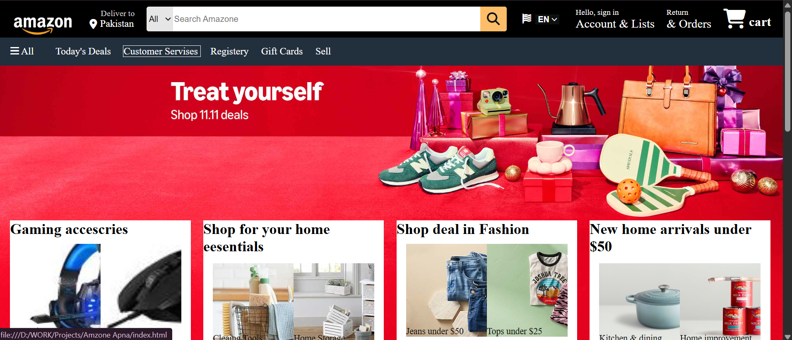

🛒 Amazon Clone 

A static clone of the Amazon homepage built using only HTML and CSS. This project replicates the visual design of Amazon's front page including the navbar, product grid, and footer.
🔗 Live Demo
[👉](https://github.com/builtbyusman/Amazon-Clone)

📸 Screenshots
💻 Desktop
;

🔍 Features
Amazon-style header with search bar and navigation
Product cards with images, titles, and pricing

🧰 Built With

HTML5
CSS3 (Flexbox & Grid)

📸 Screenshots

📂 Folder Structure
amazon-clone/
├── index.html
├── style.css
└── images/
    └── (product and layout images)

📄 License
This project is licensed under the MIT License.

